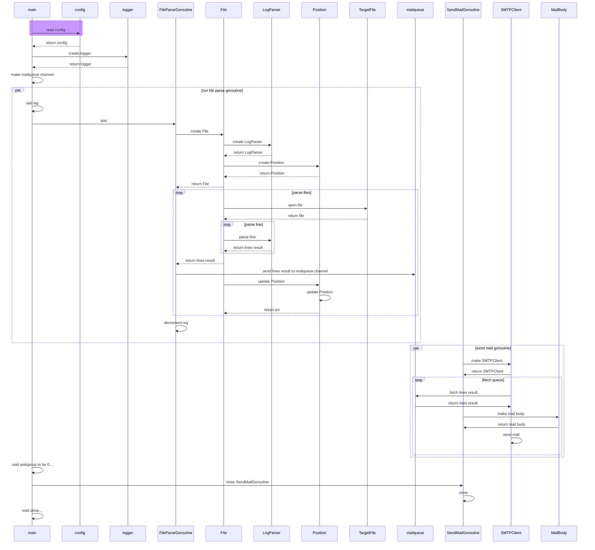

```mermaid
sequenceDiagram
  rect rgb(200, 150, 255)
  main->>config: read config
  end
  config-->>main: return config
  main->>logger: create logger
  logger-->>main: return logger
  main->>main: make mailqueue channel
  par run file parse goroutine
    main->>main: add wg
    main->>FileParseGoroutine: aaa
    FileParseGoroutine->>File: create File
    File->>LogParser: create LogParser
    LogParser-->>File: return LogParser
    File->>Position: create Position
    Position-->>File: return Position
    File-->>FileParseGoroutine: return File
    loop parse files
      File->>TargetFile: open file
      TargetFile-->>File: return file
      loop parse line
        File->>LogParser: parse line
        LogParser-->>File: return lines result
      end
      File-->>FileParseGoroutine: return lines result
      FileParseGoroutine->>mailqueue: send lines result to mailqueue channel
      File->>Position: update Position
      Position->>Position: update Position
      Position-->>File: return err
    end
    FileParseGoroutine->>FileParseGoroutine: decrement wg
  end
  par send mail goroutine
    SendMailGoroutine->>SMTPClient: make SMTPClient
    SMTPClient->>SendMailGoroutine: return SMTPClient
    loop fetch queue
      SMTPClient->>mailqueue: fetch lines result
      mailqueue->>SMTPClient: return lines result
      SendMailGoroutine->>MailBody: make mail body
      MailBody->>SendMailGoroutine: return mail body
      SMTPClient->>SMTPClient: send mail
    end
  end
  main->>main: wait waitgroup to be 0...
  main->>SendMailGoroutine: close SendMailGoroutine
  SendMailGoroutine->>SendMailGoroutine: close
  main->>main: wait close...
```

